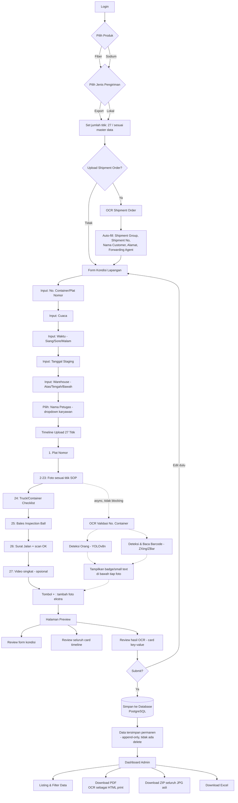
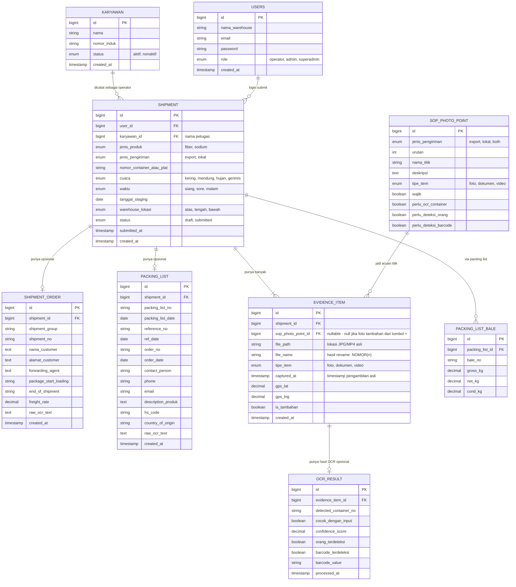

# Perkenalan Sistem: SPV-Track

Saya sedang membangun sistem bernama **SPV-Track** — sistem evidence digital untuk proses staging dan loading fiber/sodium di warehouse, menggantikan proses foto manual yang sebelumnya tersebar dan tidak terstruktur. Tolong bantu saya membangun sistem ini.

## Tujuan Utama
Menyimpan bukti foto/video proses loading container atau truck secara terstruktur, dengan timestamp, tanpa penghapusan data (untuk keperluan evidence), serta mempermudah admin dalam mengekspor laporan.

## Tech Stack
- Backend: **Laravel**
- Mobile app: **Flutter**
- Web dashboard: **Laravel** (server-rendered atau API + frontend ringan)
- Database: **PostgreSQL**
- OCR & Image Processing: solusi **open-source, tanpa layanan berbayar** — PaddleOCR/Tesseract untuk OCR teks & tabel, YOLOv8-nano untuk deteksi objek (orang/barcode area), ZXing/ZBar untuk baca barcode, dijalankan sebagai microservice Python (FastAPI) yang dipanggil dari Laravel

## Konfigurasi Database (Local Dev)
```
DB_CONNECTION=pgsql
DB_HOST=127.0.0.1
DB_PORT=5432
DB_DATABASE=evidence_warehouse
DB_USERNAME=postgres
DB_PASSWORD=root
```

## Role Pengguna
Ada 3 role: **Operator, Admin, Superadmin**. Ketiganya bisa melihat semua data tanpa pembatasan (satu departemen warehouse yang sama). Perbedaannya di hak aksi:
- **Operator**: input & submit data lapangan
- **Admin**: + download laporan (PDF/ZIP/Excel), koreksi data
- **Superadmin**: + kelola akun & data karyawan

Login tetap sederhana (akun per warehouse, bukan per individu), tapi **identitas operator lapangan dicatat lewat field "Nama Petugas"** yang berupa dropdown dari tabel `karyawan` (dikelola Superadmin) — bukan free text, supaya konsisten dan bisa diaudit.

## Alur Utama (Field App - Operator)

1. Login → pilih jenis produk: **Fiber / Sodium**
2. Pilih jenis pengiriman: **Export / Lokal**
3. (Opsional) Upload dokumen **Shipment Order** → OCR otomatis isi Shipment Group, Shipment No., Nama Customer, Alamat Customer, Forwarding Agent
4. Isi form kondisi lapangan: nomor container/plat nomor (ketik manual), cuaca (kering/mendung/hujan/gerimis), waktu (siang/sore/malam), tanggal staging, lokasi warehouse (atas/tengah/bawah), nama petugas (dropdown)
5. **Timeline upload** (1 alur card berurutan, tampilan seperti timeline/step cards), total **27 titik** per container/truck:

   | # | Titik |
   |---|---|
   | 1 | Plat Nomor |
   | 2 | Photo Fiber/Sodium di loading/staging area yang sudah dikumpulkan |
   | 3 | Photo Fiber/Sodium di loading/staging area, nomor bales terbaca saat di-zoom |
   | 4 | Photo Fiber/Sodium bagian depan sedang dibersihkan (ada orang yang membersihkan) |
   | 5 | Photo Fiber/Sodium bagian samping sedang dibersihkan (ada orang yang membersihkan) |
   | 6 | Photo Fiber/Sodium bagian atas sedang dibersihkan (ada orang yang membersihkan) |
   | 7 | Photo container bagian luar sisi kiri, nomor container terbaca |
   | 8 | Photo container bagian luar sisi kanan dari arah depan container |
   | 9 | Photo lantai container dalam keadaan kosong (wajib ada terpal untuk non woven) |
   | 10 | Photo bagian atas dalam container |
   | 11 | Photo bagian kanan dalam container, nomor container harus terbaca |
   | 12 | Photo bagian kiri dalam container |
   | 13 | Photo swab test permukaan dinding kiri menggunakan majun |
   | 14 | Photo swab test permukaan dinding kanan menggunakan majun |
   | 15 | Photo swab test permukaan dinding depan menggunakan majun |
   | 16 | Photo terisi fiber/bales baris pertama |
   | 17 | Photo terisi fiber/bales setengah container |
   | 18 | Photo terisi fiber/bales penuh dan tersegel |
   | 19 | Photo tertutup satu pintu, nomor container harus terbaca |
   | 20 | Photo container tertutup dan terkunci |
   | 21 | Photo pintu tertutup tampak segel, nomor container, plat nomor, pelayaran |
   | 22 | Foto segel |
   | 23 | Photo 2 ban diganjal stopper |
   | 24 | Truck Checklist (Lokal) / Container Checklist (Export) |
   | 25 | Bales Inspection Ball |
   | 26 | Surat Jalan + scan "OK" |
   | 27 | Video singkat |

   Titik ini sebaiknya disimpan sebagai **master data di database** (tabel `sop_photo_points`, dengan kolom `urutan`, `nama_titik`, `deskripsi`, `wajib_video`/`tipe_item`), bukan hardcode di kode program — supaya kalau SOP berubah, Superadmin cukup update data tanpa perlu ubah kode.
   - Tombol (+) tetap tersedia untuk menambah foto ekstra kapan saja dalam timeline, di luar 27 titik baku ini
6. Setiap foto yang mengandung nomor container dijalankan **OCR validasi keterbacaan** secara async setelah upload (tidak menghalangi proses lanjut), hasilnya ditampilkan sebagai small text di bawah foto untuk konfirmasi kecocokan dengan input manual — tidak memblokir submit jika tidak cocok, hanya warning
7. Setiap foto **wajib menyimpan timestamp** (tanggal & waktu pengambilan) dan idealnya lokasi GPS, diambil otomatis dari device — bukan input manual
8. Halaman **preview** seluruh data (form + seluruh card timeline + hasil OCR dalam bentuk card rincian key-value, mirip tampilan struk/rincian transaksi e-wallet) sebelum submit final
9. Submit

## Validasi SOP (ringan, tidak menghambat kecepatan kerja)
- Deteksi ada/tidaknya orang di foto (misal saat proses pembersihan bale) → YOLOv8-nano
- Deteksi area barcode & baca isinya → ZXing/ZBar
- OCR nomor container & cocokkan dengan input manual → PaddleOCR/Tesseract + regex pattern ISO 6346
- Semua validasi ini **tidak boleh memblokir submit** — hanya berupa indikator/warning, keputusan akhir tetap di tangan petugas

## Alur Admin (Web Dashboard)
- Listing seluruh data tersimpan (tabel dengan filter: tanggal, jenis produk, jenis pengiriman, nomor container, dll)
- Download PDF (termasuk teks hasil OCR sebagai HTML yang di-print, bukan sekadar gambar foto)
- Download ZIP seluruh foto JPG (**file asli JPG tetap disimpan penuh dan bisa di-preview**, meskipun sudah ada hasil OCR-nya)
- Download Excel
- Penamaan file otomatis: nomor container (Export) atau plat nomor (Lokal), format `NOMOR(1)`, `NOMOR(2)`, ... `NOMOR(n)`

## Prinsip Desain
- Data **tidak pernah dihapus** (evidence, prinsip append-only)
- Sesederhana dan sefleksibel mungkin untuk petugas lapangan — validasi jangan sampai memperlambat kerja
- Semua foto asli tetap tersimpan utuh sebagai file, terlepas dari hasil OCR/validasi apapun

## Diagram Alur Sistem (Flow)



## Diagram Database (ERD)


